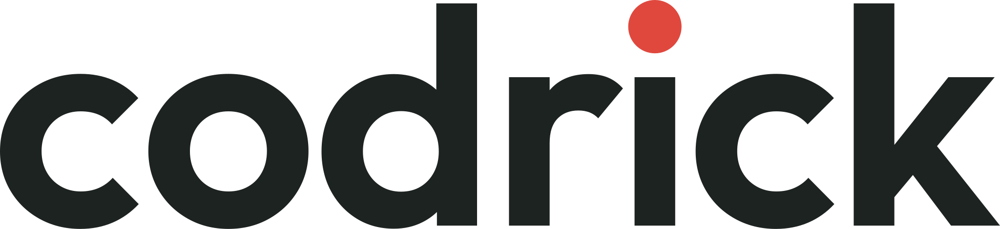

# Berat

**Senior Game Developer · Unity & C#** · 📍 Istanbul

7+ years building and operating live mobile games — shipped titles with **60M+ combined installs**

---

## 🎮 What I do

I own the parts of a mobile game that decide whether it survives after launch.

- 🏗️ **Architecture** — ScriptableObject-driven systems and DI, so features stay decoupled
- ⚡ **Performance** — profiling-first: no GC in hot paths, pooling, tight asset budgets
- 🔁 **LiveOps** — remote balancing, staged rollouts, A/B tests, same-day crash hotfixes
- 🚀 **Release** — Fastlane and TeamCity pipelines, TestFlight and Play tracks

## 🧰 Stack

**Daily**

**Also**

---

<a href="https://codrick.com">
  <picture>
    <source media="(prefers-color-scheme: dark)" srcset="codrick-wordmark-reversed.svg">
    
  </picture>
</a>

 

Outside Unity I run **Codrick**, a mobile apps & software studio in Istanbul — where my own iOS
apps ship, and where most of my product, design and App Store work happens.

**[codrick.com](https://codrick.com)** · [@codrick-dev](https://github.com/codrick-dev)
